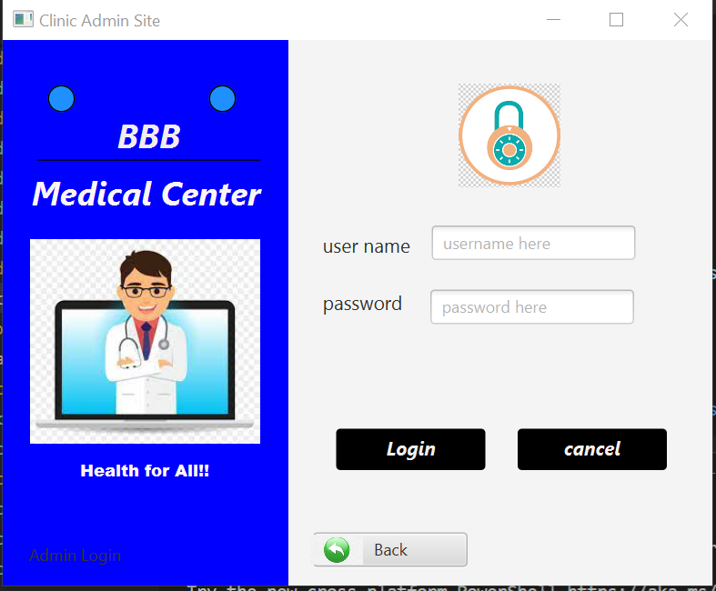

# JavaFXCMS 🔥🤘🚀

---

## 👉 Sample screenshots taken from the CM system

<br>

<br>


## 👉 Requirements

- JDK - 17.0.2
- JavaFX SDK - 17.0.2
- mysql-connector-java-8.0.28
- Scene Builder

## vmArgs Setup

```
--module-path /path/to/javafx-sdk-17.0.2/lib --add-modules javafx.controls,javafx.media
```

